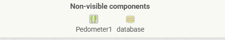
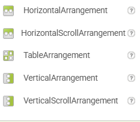
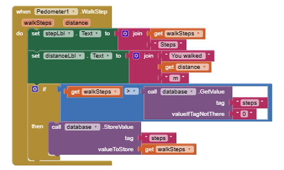
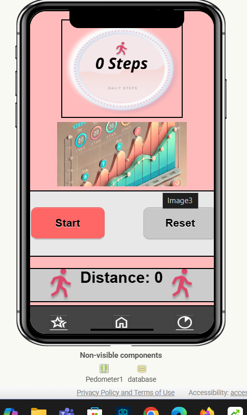
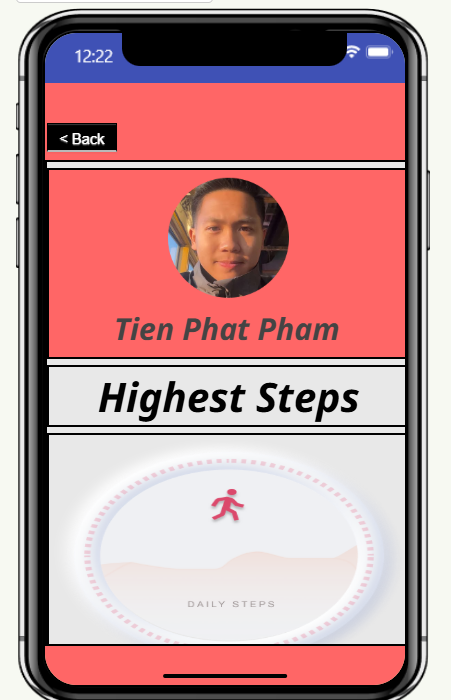
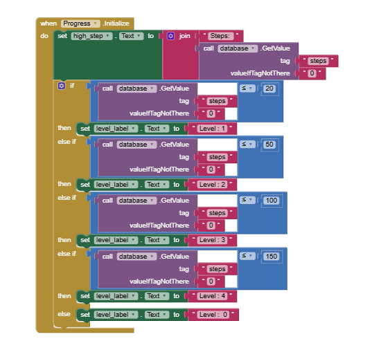

# MIT App Inventor Project

# Step Tracker App

## Overview

The Step Tracker App is a mobile application developed using MIT App Inventor. It helps users track their daily steps, set fitness goals, and monitor their progress over time. User can also compete with other people or friends. The app is designed with a user-friendly interface and provides motivational feedback to encourage a more active lifestyle.

## Features:
- Step Counting: Uses the device's built-in sensors to count steps.
- Progress Tracking: Displays progress your highest steps.
- Data Storage: Saves step count history for your progress and ranking.
- Simple UI: Easy-to-use interface with interactive elements.

## Motivation:
- The app was developed to promote a healthier lifestyle by encouraging physical activity. It provides an intuitive way for users to track and give them certain level when they reach certain steps. They could also compete with friends for family members.

## Technologies Used:

- MIT App Inventor: Used for drag-and-drop app development.
- Device Sensors: Utilized for step counting.
- TinyDB: Used for storing step count history locally.

## Development Process:
1. UI Design: Created an intuitive layout using MIT App Inventor components.
- I used some of the layout components.

**There are 4 screens in total:**
- Home
- Step Tracker
- Progress
- Ranking

For the Home screen there will be background image and a "Get started" button.

On the Step Tracker screen, there will be profile picture on the top left corner, a step counters, a start button and a reset button and a Distance counter. on the bottom it will be a navigation bar.

On the Ranking screen, there will be ranking you and other people results. Your result will be updated when you have a higher numbers of steps or level.

On the Progress screen, it will show your name, profile and your highest step which is connected to TinyDB for saving highest step history. And it is also showing where your level is at.

2. Step Tracking developing: 
- I used sensors to count steps, specifically "Pedometer".

For this block code, whenever the pedometer detects a step, it will start. It receives two parameters:
``walkSteps`` and ``distance``

The App has the "Start" and "Reset" buttons. So when ``StartStopBtn`` is clicked:
- Starts the pedometer.
- Changes the button text to "Stop".
- Changes the button background color to red.

When ``ResetBtn`` is clicked:
- Stops the pedometer (Pedometer1).
- Resets the stepLbl to 0 Steps.
- Resets the distanceLbl to 0 m.

Then also it will Checks if the step count is greater than 0 and
retrieves the saved step count from TinyDB.
Updates the database (TinyDB) with the highest steps count.

**In the Progress Screen**

On this screen, it will display your highest steps, to be able to do that, I used TinyDb components,
Checking and Updating Stored Step Data:
- The app retrieves stored step data from TinyDB ``database.GetValue``
- The tag ``steps`` is used to fetch the saved step count.
- If no stored value exists, it defaults to 0.

- The ``high_step`` label will be updated if I have a higher number of steps.
And if my steps reach over 20 it will be level 1, over 50 will be level 2 and level 3 & 4 when I reach to 100 & 150 by using ``if else`` statement.

## Resources Used:
https://www.youtube.com/watch?v=9Ur1YRCAesA

